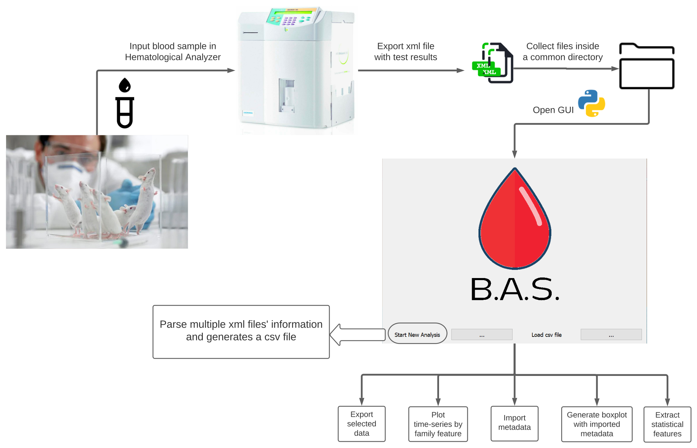

# blood-analyzer-software

## Table of contents

1. [Overview](#overview)
2. [Setup](#setup)
	- [Clone repository](#get-repository)
3. [Folder structure](#folder-structure)
4. [Features](#features)
5. [Examples](#examples)
6. [Contact us](#contact-us)
7. [License](#license)

## Overview



## Setup

Blood Analyzer Software is a [Python](https:///www.python.org)-based program. The Python language has an [Installation page](https://www.python.org/downloads/) for Windows & Mac users.

Alternatively, you can install Python in your Linux-based machine with the following steps:

```bash
#Step 1: Open up your terminal by pressing Ctrl + Alt + T.
#Step 2: Update & Upgrade your local system's repository list by entering the following command
sudo apt update & apt upgrade
#Step 3: Download the latest version of Python
sudo apt install python3
```

Make sure you have the following libraries installed in your Python environment:

- PyQt5
- matplotlib 
- pandas 
- numpy 
- xml 

### Check with pip

```bash
pip list
pip install uninstalled_package

```

### Check with conda

```bash
conda list
conda install uninstalled_package
```

### Clone repository

Open _Terminal_ or your _IDE_ of preference within your 'projects' folder and take the following steps:

```bash
#Step 1: Get sources from GitHub
$ git clone https://github.com/jazg97/Leukaemia_BloodAnalyzer.git
$ cd Leukaemia_BloodAnalyzer
$ python3 feature_code.py
```

## Folder structure

The project has the following structure:
      
    .
    │
    ├── data
    │   ├── 20211027165438.xml
    │   ├── 20221031134832.xml
    │   │
    ├── docs
    ├── features
    │   ├── cleaning_csv.py
    │   ├── generating_plots.py
    │   ├── GUI.py
    │   ├── parsing_multiple_files.py
    │   ├── parsing_xml.py
    │   ├── utils.py
    │   │
    ├── figures
    │   ├── multiple_ids_feature_ex1.png
    │   ├── multiple_ids_feature_ex2.png
    ├── features
    │   ├── cleaned_data.csv
    │   ├── columns_to_drop.csv
    │   ├── test.csv
    │   ├── test2.csv
    │   ├── test3.csv
    │   ├── test4.csv
                
## Features


```py

```

## Examples

These are some common usage examples.

## Contact Us

- Jose Zapana
[](mailto:jose.zapana@pucp.edu.pe)
[](https://github.com/jazg97)

- Eric Schmitt
[](mailto:e.schmitt@dkfz-heidelberg.de)
[](https://github.com/ECSchmitt)

## License

Blood Analyzer Software is released under the [MIT License](http://www.opensource.org/licenses/MIT) - Jose Zapana & Eric Schmitt - 2022.

