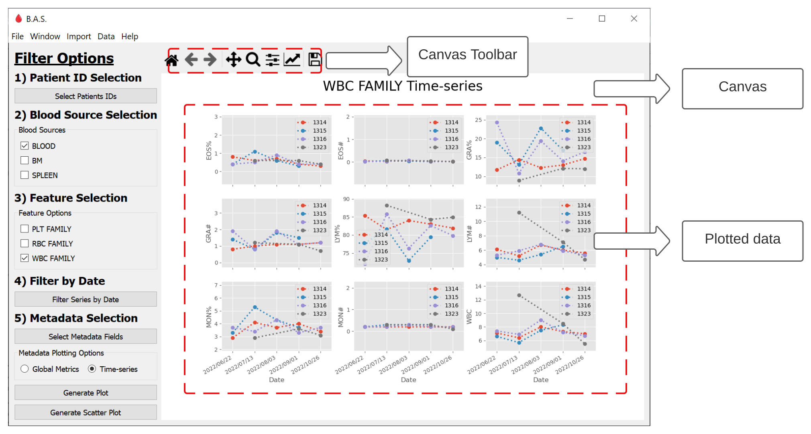
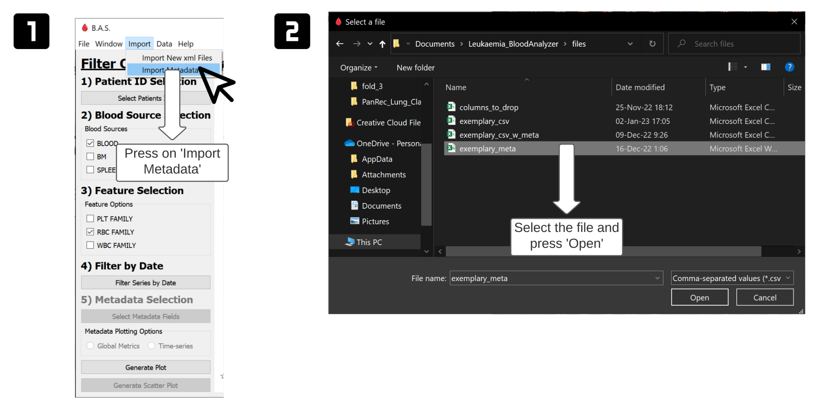
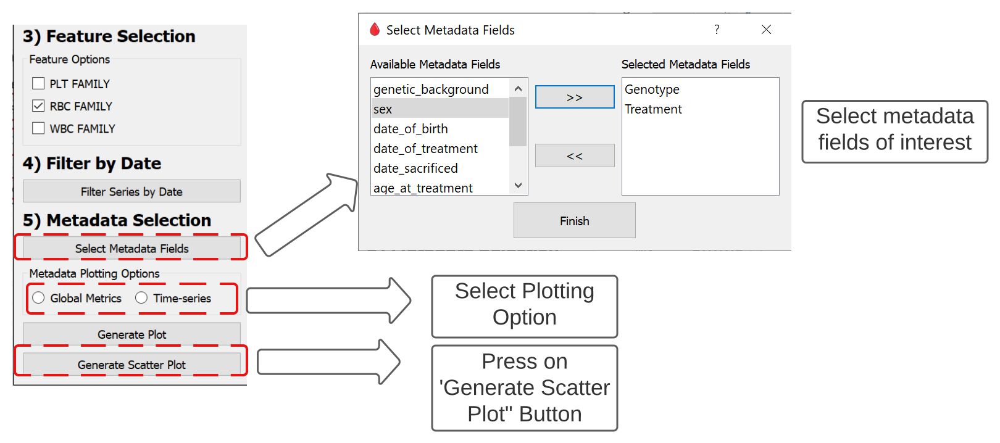
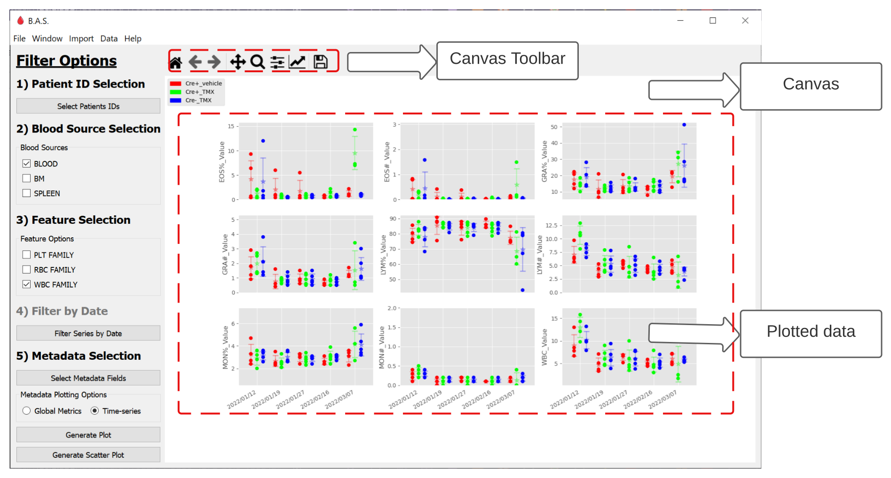

# blood-analyzer-software

## Table of contents

1. [Overview](#overview)
2. [Setup](#setup)
	- [Clone repository](#get-repository)
3. [Folder structure](#folder-structure)
4. [Features](#features)
5. [User guide](#user-guide)
6. [Contributing](#contributing)
7. [Contact us](#contact-us)
8. [License](#license)

## Overview

Blood Analyzer Software (B.A.S.) is a data visualization and explorative tool, it allows to analyze blood samples from an hematological analyzer and reformat the data into a tabular format.


## Setup

Blood Analyzer Software is a [Python](https:///www.python.org)-based program. The Python language has an [Installation page](https://www.python.org/downloads/) for Windows & Mac users.

Alternatively, you can install Python in your Linux-based machine with the following steps:

```bash
#Step 1: Open up your terminal by pressing Ctrl + Alt + T.
#Step 2: Update & Upgrade your local system's repository list by entering the following command
$ sudo apt update & apt upgrade
#Step 3: Download the latest version of Python
$ sudo apt install python3
```

Make sure you have the following packages installed in your Python environment:

- PyQt5 >= 5.9.0 (https://pypi.org/project/PyQt5/) (https://anaconda.org/anaconda/pyqt)
- matplotlib >= 3.5.0 (https://pypi.org/project/matplotlib/) 
- pandas >= 1.5.0 (https://pypi.org/project/pandas/)
- numpy >= 1.23.0 (https://pypi.org/project/numpy/)
- Pillow >= 9.2.0 (https://pypi.org/project/Pillow/) 
- xml (https://docs.python.org/3/library/xml.etree.elementtree.html)

### Check with pip

```bash
pip list
pip install uninstalled_package

```

### Check with conda

```bash
conda list
conda install uninstalled_package
```

### Clone repository

Open _Terminal_ or your _IDE_ of preference within your 'projects' folder and take the following steps:

```bash
#Step 1: Get sources from GitHub
$ git clone https://github.com/jazg97/BloodAnalyzerSoftware.git
$ cd BloodAnalyzerSoftware
$ python3 feature_code.py
```

## Folder structure

The project has the following structure:
      
    .
    │
    ├── data
    │   ├── 20211027165438.xml
    │   ├── 20221031134832.xml
    │   │
    ├── docs
    ├── code
    │   ├── cleaning_csv.py
    │   ├── generating_plots.py
    │   ├── GUI.py
    │   ├── parsing_multiple_files.py
    │   ├── parsing_xml.py
    │   ├── utils.py
    │   │
    ├── figures
    │   ├── multiple_ids_feature_ex1.png
    │   ├── multiple_ids_feature_ex2.png
    ├── exemplaryFiles
    │   ├── exemplary_csv.csv
    │   ├── exemplary_csv_w_meta.csv
	│   ├── exemplary_meta.xlsx
	
                
## Features

The Blood Analyzer Software (B.A.S.) is a data visualization and explorative tool, consequently most of its features are related to these tasks.

1. Generate csv files from xml files: Choose a directory that contains all the XML of interest and obtain a csv file with all its data reformatted.
2. Plot time-series by feature family, patients' ID and dates: Visualize time-series from ids of interest, see trends and compare subpopulations.
3. Import metadata: Add new data into the csv file which could further help in the analysis of the study.
4. Generate boxplot with imported metadata keys
	1. Global plot: Obtain global statistics related to metadata of interest.
	2. Boxplot time-series: Visualize time-series from ids of interested located inside the metadata file.

## User Guide

There are two options to access the program. You can run the program 'GUI.py' from the command line or open the executable. These are the main sections and features accesible in the program.

### 1) Start new analysis


<details>

<summary title="Click to expand/collapse">1. Generate new `CSV` file without GUI</summary>

You can generate `CSV` files without launching B.A.S, follow these steps:

```py
$ cd BloodAnalyzerSoftware
$ python3 ./code/generate_csv.py <input_data_directory> <output_directory>/<output_filename>.csv
```
</details>

<details>

<summary title="Click to expand/collapse">2. Generate new csv file in GUI</summary>

You can open the GUI over the command line by carrying out the steps described below:

```py
$ cd BloodAnalyzerSoftware
$ python3 ./code/GUI.py
```

Altenatively, you can just run the .exe. Either way, here are the steps you need to follow to create a new `CSV` file in the GUI.


</details>

### 2) Access a dataset of interest

<details>

<summary title="Click to expand/collapse"> 1. Open `CSV` file </summary>

Here's what you need to do to access the `CSV` file with the relevant dataset:


</details>

### 3) Explore and visualize data

<details>

<summary title="CLick to expand/collapse"> 1. Select and Filter Data </summary>

Once you have accessed a dataset, you can explore and visualize its data following these instructions.


</details>

<details>

<summary title=""> 2. Show Data </summary>

Example of time-series plot.



</details>

### 4) Add metadata 

<details>
<summary title="Click to expand/collapse"> 1. Recommended file format </summary>

You need to format your metadata as shown below and save it as a `CSV` or `XSLX` file.
 
| animal_id   | Genotype    | Treatment   | Date-of-interest |... |
| ----------- | ----------- | ----------- | ---------------- |--- |
| ID #1       | Control+    | Treat #1    | dd-mm-YYYY       |... |
| ID #2       | Test-       | Treat #2    | dd-mm-YYYY       |... |
| ...         | ...         | ...         | ...              |... |

It is especially important to write the ID identically as it's in the original `CSV` file, as without this, it won't be associated correctly inside the program.

</details>

<details>

<summary = "Click to expand/collapse"> 2. Upload metadata </summary>

You can load the metadata file into the dataset following accessing the Import Menu.



</details>


### 5) Generate boxplot with metadata

<details>

<summary title="Click to expand/collapse"> 1. Select metadata </summary>

Similar to ID and Family selection, you can select metadata of interest and choose between plotting global or time-series results of your experiment.



</details>

<details>
<summary title="Click to expand/collapse"> 2. Show Global Results  </summary>

Example of Global results.


</details>

<details>
<summary title="Click to expand/collapse"> 3. Show Time-series Results  </summary>

Example of Time-series Results



</details>

## Contributing

If you'd like to contribute to this project, please follow these steps:

1. Fork the repository
2. Create a new branch for your changes
3. Make your changes and commit them with descriptive commit messages
4. Push your changes to your fork
5. Create a pull request from your fork to the main repository

## Contact Us

- Jose Zapana
[](mailto:jose.zapana@pucp.edu.pe)
[](https://github.com/jazg97)

- Eric Schmitt
[](mailto:e.schmitt@dkfz-heidelberg.de)
[](https://github.com/ECSchmitt)

## License

Blood Analyzer Software is released under the [MIT License](http://www.opensource.org/licenses/MIT) - Jose Zapana & Eric Schmitt - 2023.