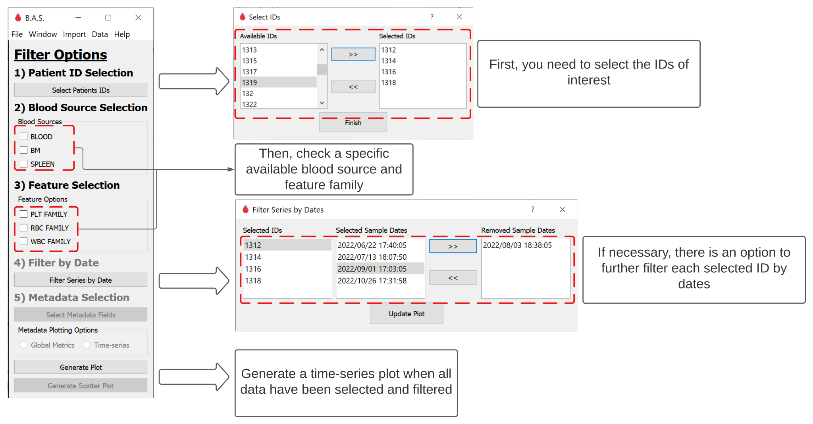

# blood-analyzer-software

## Table of contents

1. [Overview](#overview)
2. [Setup](#setup)
	- [Clone repository](#get-repository)
3. [Folder structure](#folder-structure)
4. [Features](#features)
5. [Examples](#examples)
6. [Contributing](#contributing)
7. [Contact us](#contact-us)
8. [License](#license)

## Overview

Blood Analyzer Software (B.A.S.) is a data visualization and explorative tool, it allows to analyze blood samples from an hematological analyzer and reformat the data into a tabular format.


## Setup

Blood Analyzer Software is a [Python](https:///www.python.org)-based program. The Python language has an [Installation page](https://www.python.org/downloads/) for Windows & Mac users.

Alternatively, you can install Python in your Linux-based machine with the following steps:

```bash
#Step 1: Open up your terminal by pressing Ctrl + Alt + T.
#Step 2: Update & Upgrade your local system's repository list by entering the following command
$ sudo apt update & apt upgrade
#Step 3: Download the latest version of Python
$ sudo apt install python3
```

Make sure you have the following packages installed in your Python environment:

- PyQt5 >= 5.9.0 (https://pypi.org/project/PyQt5/) (https://anaconda.org/anaconda/pyqt)
- matplotlib >= 3.5.0 (https://pypi.org/project/matplotlib/) 
- pandas >= 1.5.0 (https://pypi.org/project/pandas/)
- numpy >= 1.23.0 (https://pypi.org/project/numpy/)
- Pillow >= 9.2.0 (https://pypi.org/project/Pillow/) 
- xml (https://docs.python.org/3/library/xml.etree.elementtree.html)

### Check with pip

```bash
pip list
pip install uninstalled_package

```

### Check with conda

```bash
conda list
conda install uninstalled_package
```

### Clone repository

Open _Terminal_ or your _IDE_ of preference within your 'projects' folder and take the following steps:

```bash
#Step 1: Get sources from GitHub
$ git clone https://github.com/jazg97/BloodAnalyzerSoftware.git
$ cd BloodAnalyzerSoftware
$ python3 feature_code.py
```

## Folder structure

The project has the following structure:
      
    .
    │
    ├── data
    │   ├── 20211027165438.xml
    │   ├── 20221031134832.xml
    │   │
    ├── docs
    ├── code
    │   ├── cleaning_csv.py
    │   ├── generating_plots.py
    │   ├── GUI.py
    │   ├── parsing_multiple_files.py
    │   ├── parsing_xml.py
    │   ├── utils.py
    │   │
    ├── figures
    │   ├── multiple_ids_feature_ex1.png
    │   ├── multiple_ids_feature_ex2.png
    ├── exemplaryFiles
    │   ├── exemplary_csv.csv
    │   ├── exemplary_csv_w_meta.csv
	│   ├── exemplary_meta.xlsx
	
                
## Features

The Blood Analyzer Software (B.A.S.) is a data visualization and explorative tool, consequently most of its features are related to these tasks.

1. Generate csv files from xml files: Choose a directory that contains all the XML of interest and obtain a csv file with all its data reformatted.
2. Plot time-series by feature family, patients' ID and dates: Visualize time-series from ids of interest, see trends and compare subpopulations.
3. Import metadata: Add new data into the csv file which could further help in the analysis of the study.
4. Generate boxplot with imported metadata keys
	4.1. Global plot: Obtain global statistics related to metadata of interest.
	4.2. Boxplot time-series: Visualize time-series from ids of interested located inside the metadata file.
5. Extract statistical features: Obtain statistical features from the plotted data.

## Examples

There are two approaches you can take when using the B.A.S. First, you can modify and adapt the provided codes (./code), and run everything from terminal as a minimal version.
Additionally, you can just run the executable GUI provided in the repository and explore your dataset.

These are some common usage examples.

1. New Analysis

	1. Start new analysis

		1. Generate new csv file without GUI

		The file generate_csv.py can generate csv files from a single directory, you need to follow these steps:

		```py
		$ cd BloodAnalyzerSoftware
		$ python3 ./code/generate_csv.py files_dir output_dir/output_name.csv
		```

	2. Generate new csv file with GUI

		You can open the GUI over the command line by following these steps:

		```py
		$ cd BloodAnalyzerSoftware
		$ python3 features/GUI.py
		$ #Then select the option of Start New Analysis
		```

		Altenatively, you can just run the .exe. Either way, there are 3 steps when you create a new csv file from the GUI.

		

1.2. Explore data by patients' ID, feature family and date



2. Recurrent Analysis


## Contributing

If you'd like to contribute to this project, please follow these steps:

1. Fork the repository
2. Create a new branch for your changes
3. Make your changes and commit them with descriptive commit messages
4. Push your changes to your fork
5. Create a pull request from your fork to the main repository

## Contact Us

- Jose Zapana
[](mailto:jose.zapana@pucp.edu.pe)
[](https://github.com/jazg97)

- Eric Schmitt
[](mailto:e.schmitt@dkfz-heidelberg.de)
[](https://github.com/ECSchmitt)

## License

Blood Analyzer Software is released under the [MIT License](http://www.opensource.org/licenses/MIT) - Jose Zapana & Eric Schmitt - 2023.

